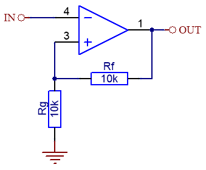

# Pomodoro Nixie
It is a work that I do for my motivation to work in the evenings, using the pomodoro technique. 

## Hardware Part List

| HW                      | Description                                            |
| ----------------------- | ------------------------------------------------------ |
| `Driver`                | [From Tindie](https://www.tindie.com/products/marcinsaj/nixie-tube-driver-v2/) |
| `MCU`                   | Arduino Uno                                            |
| `Nixie Tubes`           | IN12-B                                                 |
| `Button`                | Standart Button                                        |
| `HV PSU`                | https://nixieclock.org                                 |

## Feedback

## Usage
You can set the minute with a button, after setting the minute, it will start working after a long press.

##  Awesome 😍

